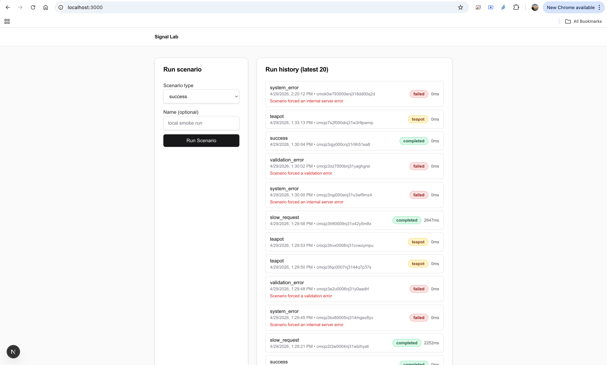
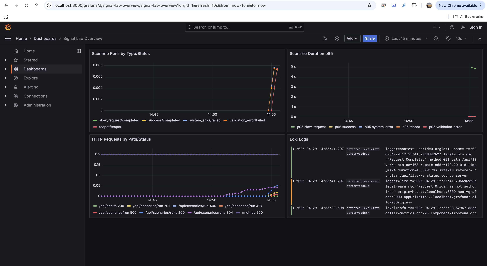
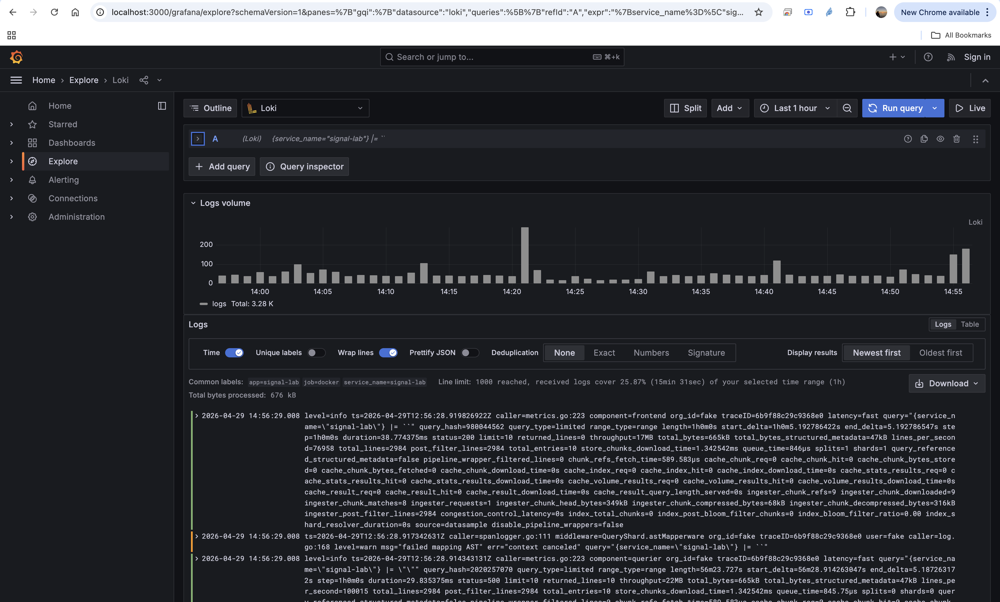
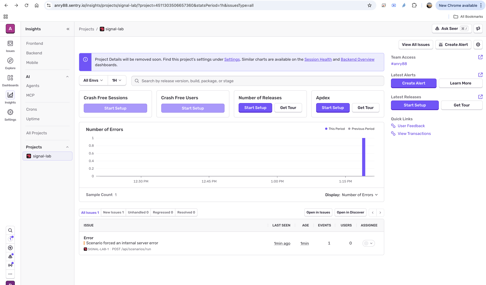
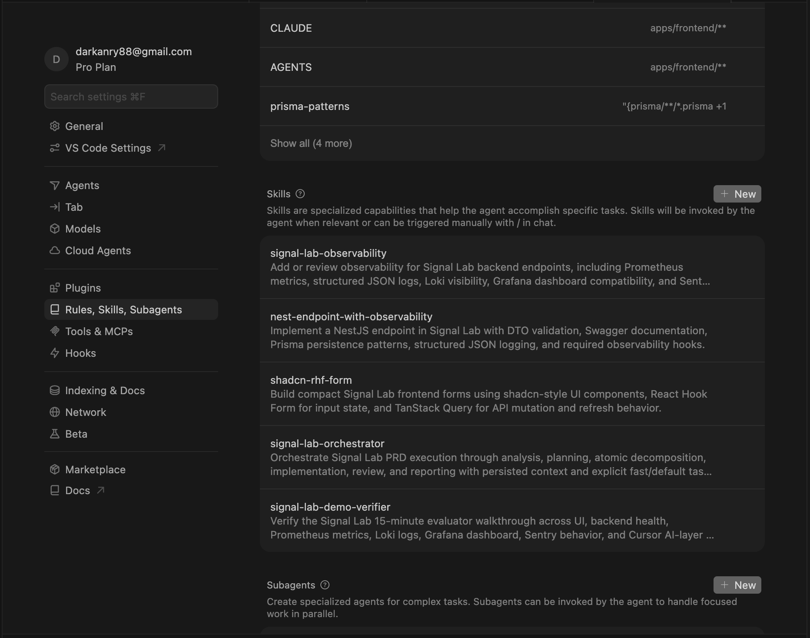
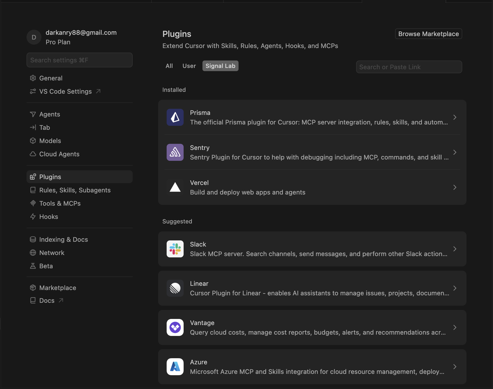

# Signal Lab — Submission Checklist

Файл заполнен как быстрый навигатор для 15-минутной проверки решения.

---

## Репозиторий

- **URL**: `https://github.com/anry88/Signal-Lab`
- **Ветка**: `main`
- **Время работы** (приблизительно): `8` часов

---

## Запуск

```bash
# Запуск всего окружения:
docker compose up -d

# Быстрая проверка:
docker compose ps
curl -sS http://localhost:3001/api/health
curl -sS http://localhost:3001/metrics | rg "scenario_runs_total|scenario_run_duration_seconds|http_requests_total"

# Остановка:
docker compose down --remove-orphans
```

**Предусловия**: Docker + Docker Compose, свободные порты `3000`, `3001`, `3100`, `5432`. Для полной проверки Sentry нужен реальный `SENTRY_DSN` в локальном `.env`; секреты в репозиторий не коммитятся.

---

## Стек — подтверждение использования

| Технология | Используется? | Где посмотреть |
|-----------|:------------:|----------------|
| Next.js (App Router) | ☑ | `apps/frontend/app/layout.tsx`, `apps/frontend/app/page.tsx` |
| shadcn/ui | ☑ | `apps/frontend/components/ui/*` |
| Tailwind CSS | ☑ | `apps/frontend/tailwind.config.ts`, `apps/frontend/app/globals.css` |
| TanStack Query | ☑ | `apps/frontend/app/providers.tsx`, `apps/frontend/app/page.tsx` |
| React Hook Form | ☑ | `apps/frontend/app/page.tsx` |
| NestJS | ☑ | `apps/backend/src/main.ts`, `apps/backend/src/app.module.ts` |
| PostgreSQL | ☑ | `docker-compose.yml`, `prisma/schema.prisma` |
| Prisma | ☑ | `prisma/schema.prisma`, `apps/backend/src/prisma/prisma.service.ts` |
| Sentry | ☑ | `apps/backend/src/main.ts`, `apps/backend/src/scenarios/scenarios.service.ts` |
| Prometheus | ☑ | `apps/backend/src/observability/*`, `observability/prometheus/prometheus.yml` |
| Grafana | ☑ | `observability/grafana/dashboards/signal-lab.json` |
| Loki | ☑ | `observability/loki/loki-config.yml`, `observability/promtail/promtail-config.yml` |

---

## Observability Verification

| Сигнал | Как воспроизвести | Где посмотреть результат |
|--------|-------------------|--------------------------|
| Prometheus metric | Запустить `success` и `system_error` из UI или через `POST /api/scenarios/run` | `http://localhost:3001/metrics`; проверить `scenario_runs_total`, `scenario_run_duration_seconds`, `http_requests_total` |
| Grafana dashboard | После 2-3 scenario runs открыть Grafana | `http://localhost:3000/grafana`; dashboard `Signal Lab Overview`, панели должны быть не пустыми |
| Loki log | Запустить `system_error` или `validation_error` | `http://localhost:3100/loki/api/v1/labels` и query `{app="signal-lab"}` |
| Sentry exception | Указать реальный `SENTRY_DSN`, затем запустить `system_error` | Sentry event с сообщением `Scenario forced an internal server error`, tags/extras со scenario context |

Важно по Sentry: локальный `docker-compose.yml` не поднимает Sentry server. В приложении есть `@sentry/node` SDK, который отправляет errors во внешний Sentry project, если задан `SENTRY_DSN`. Cursor Sentry plugin тоже не является локальным Sentry instance; он нужен для workflow/triage через Cursor.

Дополнительная проверка bonus-сценария:

```bash
curl -sS -X POST http://localhost:3001/api/scenarios/run \
  -H "Content-Type: application/json" \
  -d '{"type":"teapot","name":"bonus-check"}'
```

Ожидаемый результат: HTTP `418`, тело с `signal: 42`, запись в базе с `metadata: { easter: true }`.

---

## Cursor AI Layer

### Custom Skills

| # | Skill name | Назначение |
|---|------------|------------|
| 1 | `signal-lab-observability` | Добавляет и проверяет Prometheus metrics, JSON logs, Loki/Grafana/Sentry coverage |
| 2 | `nest-endpoint-with-observability` | Ведёт создание NestJS endpoints с DTO, Swagger, Prisma, logs и metrics |
| 3 | `shadcn-rhf-form` | Помогает собирать compact UI forms через shadcn/ui, RHF и TanStack Query |
| 4 | `signal-lab-demo-verifier` | Проводит финальную 15-minute evaluator walkthrough |
| 5 | `signal-lab-orchestrator` | Делит PRD execution на фазы, хранит context и маршрутизирует задачи fast/default model |

### Commands

| # | Command | Что делает |
|---|---------|------------|
| 1 | `/add-endpoint` | Ведёт добавление backend endpoint с observability checklist |
| 2 | `/check-obs` | Проверяет local Docker observability stack |
| 3 | `/run-prd` | Запускает PRD через orchestrator workflow с resume |

### Hooks

| # | Hook | Какую проблему решает |
|---|------|----------------------|
| 1 | `block-secrets-commit.sh` через `signal-lab-guard.sh` | Блокирует staged secrets/config credentials перед agent-run commit |
| 2 | `endpoint-observability-guard.sh` через `signal-lab-guard.sh` | Ловит backend endpoint changes без metric/log/Sentry markers |

Активная точка подключения hooks: `.cursor/hooks.json`. Используется dispatcher `signal-lab-guard.sh`, чтобы несколько проверок возвращали единый результат.

### Rules

| # | Rule file | Что фиксирует |
|---|-----------|---------------|
| 1 | `stack-constraints.mdc` | Обязательный стек и порты evaluator walkthrough |
| 2 | `observability-conventions.mdc` | Названия метрик, labels, JSON log fields, Sentry conventions |
| 3 | `frontend-patterns.mdc` | RHF, TanStack Query, shadcn/ui, compact operational UI |
| 4 | `prisma-patterns.mdc` | Prisma-only data access, migrations, ScenarioRun compatibility |
| 5 | `error-handling.mdc` | Backend exception shape и frontend error UX |

### Marketplace Skills

Marketplace skills подключены через Cursor plugins. Они могут не отображаться в локальном списке Signal Lab `.cursor/skills`; локальный список показывает 5 custom project skills.

| # | Skill | Зачем подключён |
|---|-------|----------------|
| 1 | `nextjs` через Vercel plugin | Next.js App Router conventions |
| 2 | `shadcn` через Vercel plugin | shadcn/ui + Tailwind component composition |
| 3 | `react-best-practices` через Vercel plugin | React/TSX quality review |
| 4 | `verification` через Vercel plugin | Visual frontend verification |
| 5 | `prisma-cli-migrate-deploy` через Prisma plugin | Prisma migration command guidance |
| 6 | `prisma-client-api-transactions` через Prisma plugin | Prisma transaction patterns |
| 7 | `sentry-nestjs-sdk` через Sentry plugin | Sentry SDK setup for NestJS |
| 8 | `sentry-workflow` / `sentry-fix-issues` через Sentry plugin | Sentry-guided issue triage/fix workflow |
| 9 | `sentry-create-alert` / `sentry-feature-setup` через Sentry plugin | Настройка alerts и дополнительных Sentry features |

**Что закрыли custom skills, чего нет в marketplace:** правила конкретно для Signal Lab: типы сценариев, точные имена metrics и labels, JSON log fields, `/grafana` subpath, Loki query, финальная demo-проверка, `context.json` и resume workflow для orchestrator.

---

## Orchestrator

- **Путь к skill**: `.cursor/skills/signal-lab-orchestrator/SKILL.md`
- **Путь к context file** (пример): `.execution/<timestamp>/context.json`
- **Сколько фаз**: `7`
- **Фазы**: `analysis`, `codebase`, `planning`, `decomposition`, `implementation`, `review`, `report`
- **Какие задачи для fast model**: анализ PRD, обзор codebase, простые DTO/UI/metrics/logs/docs задачи, readonly review, итоговый отчёт
- **Какие задачи для default model**: планирование, декомпозиция, решения на стыке нескольких систем, сложный review
- **Поддерживает resume**: да; повторный запуск читает `context.json` и не должен перевыполнять завершённые фазы
- **Связь с другими skills**: backend -> `nest-endpoint-with-observability`, frontend -> `shadcn-rhf-form`, observability -> `signal-lab-observability`, финальная проверка -> `signal-lab-demo-verifier`

---

## Скриншоты / видео

- [x] UI приложения: `screenshots/ui-scenario-run-history.png`
- [x] Grafana dashboard с данными: `screenshots/grafana-signal-lab-dashboard.png`
- [x] Loki logs: `screenshots/grafana-loki-explore-logs.png`
- [x] Sentry error: `screenshots/sentry-system-error-event.png`
- [x] Cursor skills screen с 5 локальными custom skills: `screenshots/cursor-local-custom-skills.png`
- [x] Cursor plugins установлены: Vercel, Prisma, Sentry: `screenshots/cursor-marketplace-plugins.png`

### Preview

UI приложения:



Grafana dashboard:



Loki logs в Grafana Explore:



Sentry system error event:



Cursor local custom skills:



Cursor marketplace plugins:



---

## Что улучшил бы первым при +4 часах

- Добавил бы короткое видео walkthrough поверх уже приложенных скриншотов.
- Добавил бы GitHub Actions smoke check для backend/frontend build и `docker compose config`.
- Прогнал бы clean-clone verification на отдельной машине или в свежей директории.
- Улучшил бы dashboard: больше фильтров по `scenarioType`, отдельная panel для `teapot`, annotation для `system_error`.
- Для production-подобной версии добавил бы полноценное secret management вместо локального `.env`.

---

## Вопросы для защиты

1. **Почему именно такая декомпозиция skills?**
   Marketplace skills дают общую экспертизу по Next.js, Prisma и Sentry. Кастомные скиллы фиксируют правила конкретно этого проекта: типы сценариев, названия метрик, формат логов, порты, порядок проверки и требования к наблюдаемости.

2. **Какие задачи подходят для малой модели и почему?**
   Малой модели подходят локальные изменения с понятным шаблоном: DTO, метод контроллер, простой UI компонент, добавление метрик/логов, обновление документации. У таких задач небольшой радиус отклонения и чёткие критерии приемки.

3. **Какие marketplace skills подключил, а какие заменил custom — и почему?**
   Подключены скиллы из Vercel, Prisma и Sentry. Они закрывают общие знания по фреймворкам и инструментам. Кастомные скиллы не заменяют их, а добавляют правила Signal Lab: observability contracts, orchestrator и demo verification.

4. **Какие hooks реально снижают ошибки в повседневной работе?**
   Secret guard блокирует случайный коммит DSN, токенов и похожих секретов. Endpoint observability guard предупреждает, если backend endpoint изменён без metrics/logs/Sentry markers.

5. **Как orchestrator экономит контекст по сравнению с одним большим промптом?**
   Он хранит состояние в `.execution/<timestamp>/context.json`, делит PRD на фазы и небольшие задачи, помечает маршрут модели и позволяет продолжить работу без повторного чтения всего предыдущего контекста.
